# 🎓 Student Quiz Portal

🧠 **Student Quiz Portal** is a full-stack web application designed for students to practice quizzes, track performance, and compete via leaderboards.  
The system follows a **secure, role-based architecture** with  **admin-controlled user management**, suitable for **college academic projects**  and  **real-world demonstrations**.

---

## 🌐 Live Deployment

🔹**Frontend (Netlify):**
 👉 https://studentquizportal.netlify.app
 
🔹**Backend (Render):**
 👉 Hosted using PHP APIs on Render free tier  

---

## 🖼️ Application Preview

### 🏠 Home Pages
**Public Home (Before Login)**
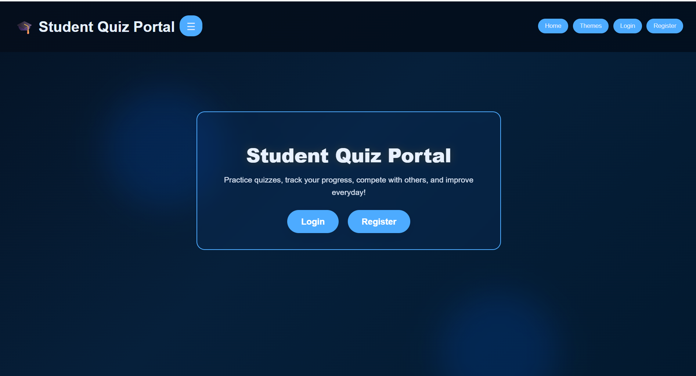

**Student Home (After Login)**
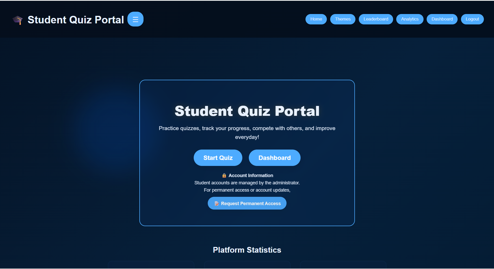

**Admin Home Page(After Login)**
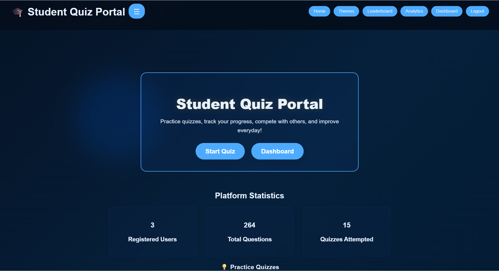

---

### 👨‍🎓 Student Dashboard
**Student Dashboard (After Login)**
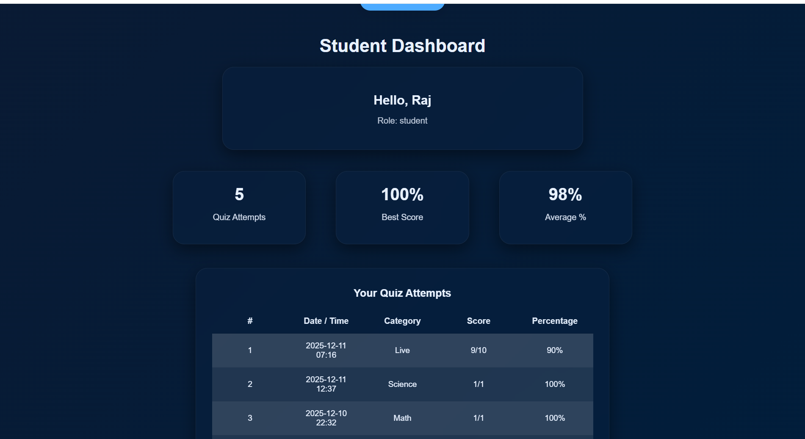

---

### 👑 Admin Dashboard
**Admin Dashboard**
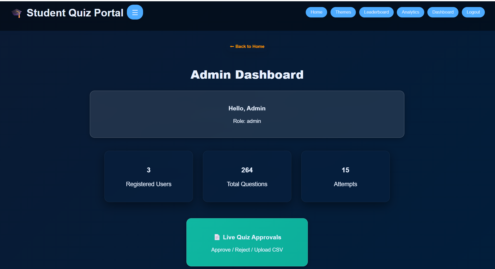

---

### 🧠 Quiz Flow & Modes
**Quiz Modes Selection**
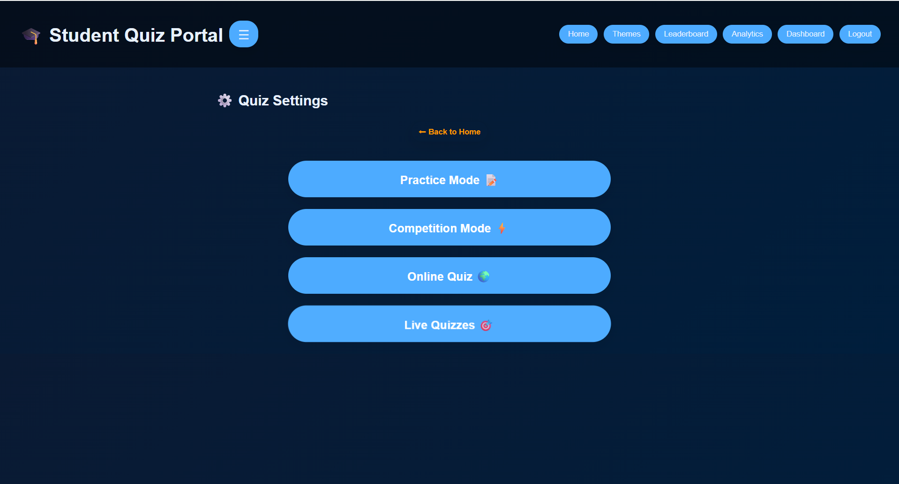

**Quiz Topics View**
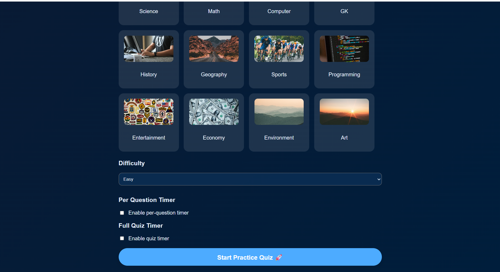

**Quiz Start Screen**
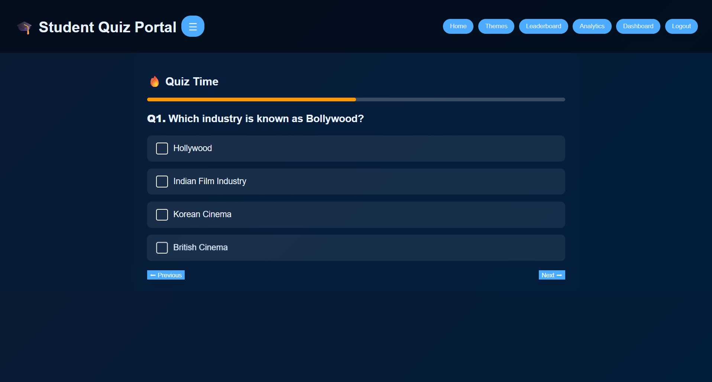

**Quiz Result Summary**
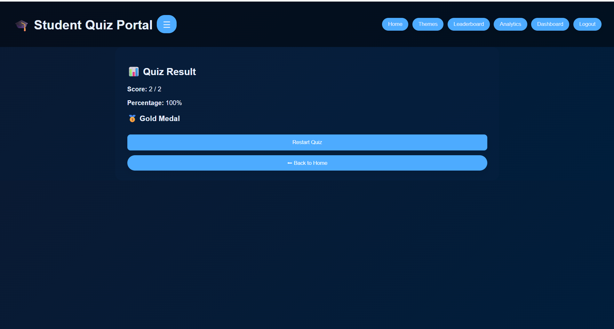

---

### 📊 General Features
**Leaderboard View**
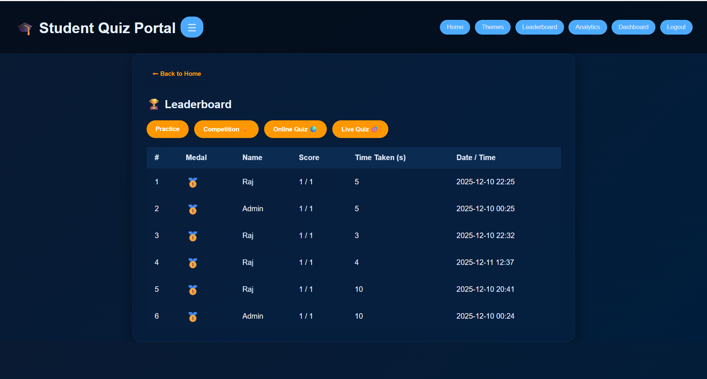

**Performance Analytics**
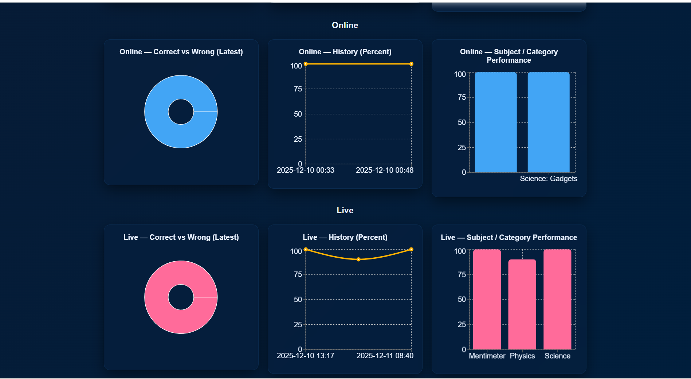

---

### 👑 Admin Management
**User & Quiz Approval Panel**
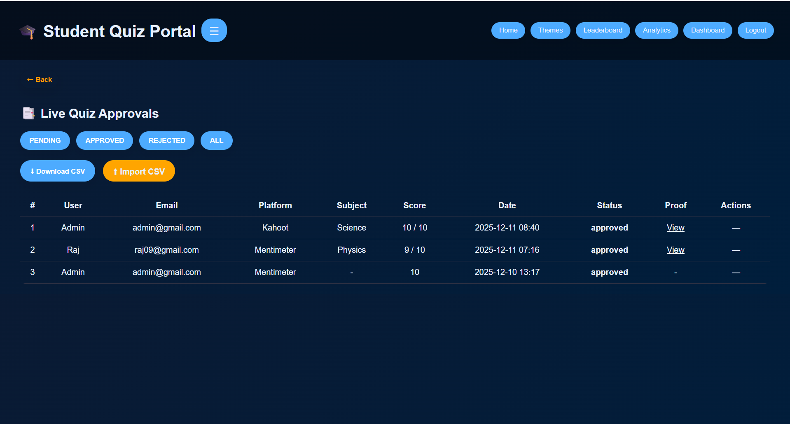

**Add New Quiz Question**
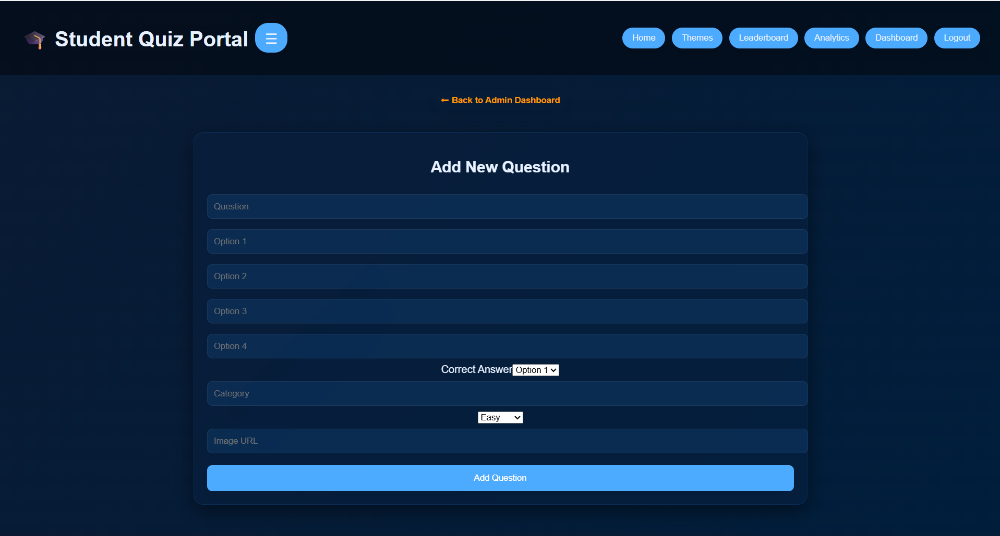

**Manage Existing Questions**
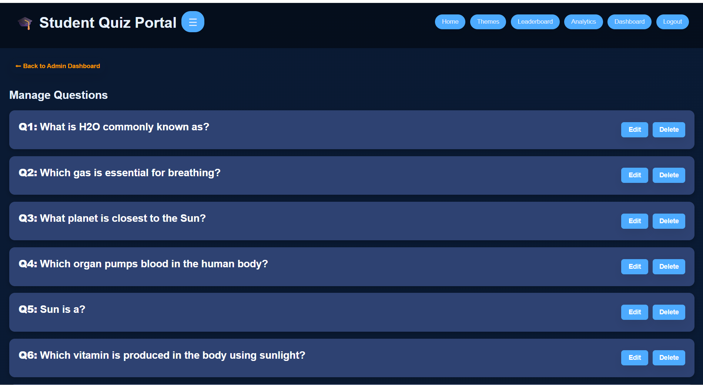

---

### 🎨 Theme Support
**Theme Selector (Light / Dark)**
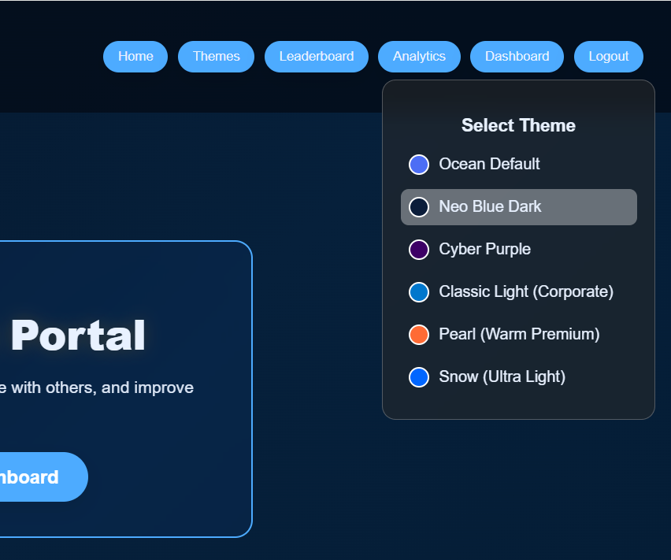

---

### 📱 Mobile View

**📱 Mobile – Public Home**  
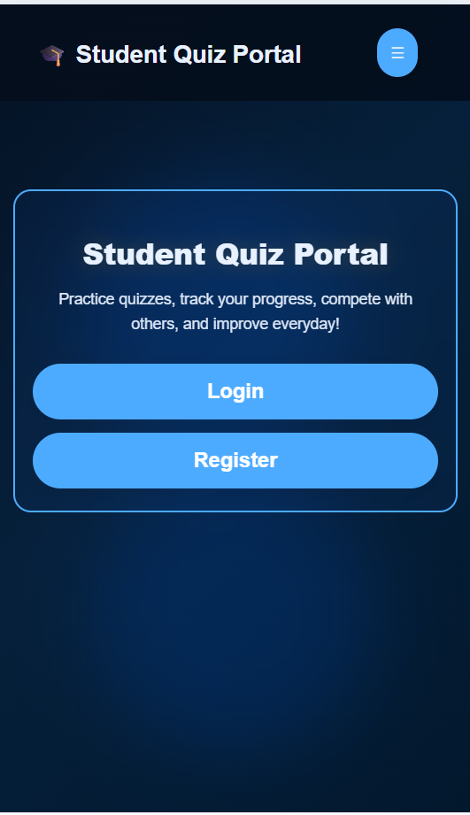

---

**📱 Mobile – Student Home**  
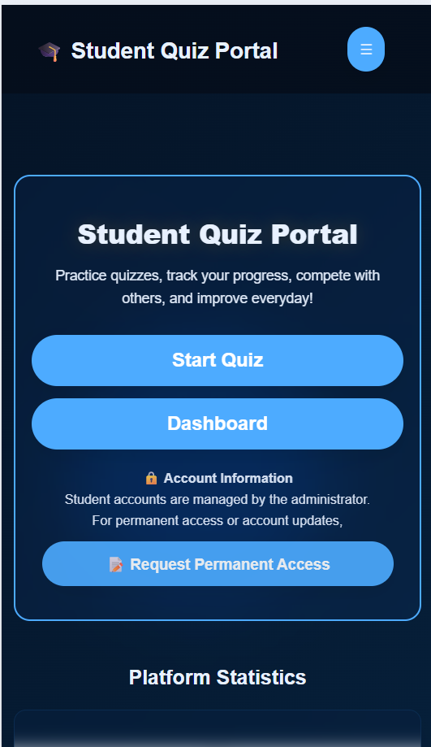

---

**📱 Mobile – Student Dashboard**  
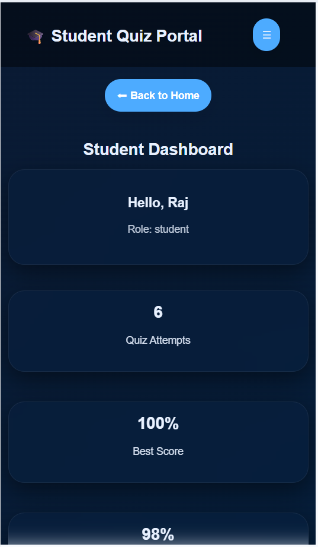

---

## ✨ Key Features

### 👨‍🎓 Student Features
- ✅ Secure login using **JWT authentication**
- 📝 Attempt quizzes and view scores
- 📊 Track personal quiz attempts
- 🏆 View leaderboard rankings
- 🔒 Account access managed by administrator

---

### 🛠 Admin Features
- 👑 Admin dashboard
- ➕ Add / edit quiz questions
- 📈 View platform-wide statistics
- 👥 Manage student accounts manually
- 📊 Monitor total attempts and users

---

## 🔐 Authentication & Security
- 🔑 **JWT-based authentication** for secure session handling
- 🔒 Passwords stored using  **hashed encryption**
- 🚫 No automatic password reset (avoids misuse on free hosting)
- 👨‍💼 Admin-approved permanent access model

> ℹ️ Password recovery and permanent access requests are handled  **manually** via Google Forms for reliability and security.

---

## 📝 Account Recovery & Permanent Access Flow

Since free hosting environments reset file storage:

- 🔹 New users can **register temporarily** 
- 🔹 For permanent access, users submit a **Google Form request**
- 🔹 Admin reviews requests and manually approves users
- 🔹 Approved users are added to `users.json` and deployed

📄 **Request Form:**
👉 https://forms.gle/mAUfC8vNhUA1VwNK6

---

## 📊 Platform Statistics

Displayed dynamically on the Home page:

- 👥 Total Registered Users
- ❓ Total Questions
- 🧪 Total Quiz Attempts (Admin)
- 📌 Personal Attempts (Student)

---

## 🧩 Technology Stack

### 🎨 Frontend
- ⚛️ React.js
- 🎨 CSS3 (Theme support + Mobile overrides)
- 📱 Fully responsive (Desktop & Mobile)

### ⚙️ Backend
- 🐘 PHP (REST APIs)
- 📄 JSON-based storage
- 🔐 JWT authentication
- 🌍 Hosted on Render

---

## 📁 Data Storage Design (Important)

⚠️ **Why JSON instead of Database?**

- 🔹 Free hosting (Render) does **not guarantee persistent storage**
- 🔹 JSON ensures predictable behavior for academic projects
- 🔹 Manual admin approval avoids data loss
- 🔹 Ideal for college-level demonstrations
  
> 📌 Attempts & users persist across sessions as long as deployment remains active.

---

## 📱 Responsive UI

- 💻 Desktop-optimized layout
- 📱 Mobile-friendly navigation
- 🎨 Theme switcher (Light / Dark modes)
- 🧭 Sidebar + Navbar for easy access

---

## 🚀 Deployment Notes

- 🔁 Netlify auto-deploys on GitHub push
- 🔁 Render redeploys backend on updates
- ⚠️ Free tier may sleep after inactivity (normal behavior)

---

## 🧪 Known Limitations (Free Hosting)

- ❌ No automated email OTP
- ❌ No self-service password reset
- ❌ Manual admin approval required

> 📌 These are **intentional design decisions** to ensure reliability.

---

## 🔮 Future Enhancements

- 🗄️ Database integration (MySQL)
- 🔔 Email notifications
- 📊 Advanced analytics dashboard
- 🔐 Google OAuth login
- 📱 PWA support

---

## 📘 Academic Use Case

This project is ideal for:

- 🎓 College Mini / Major Projects
- 🧪 Software Engineering Demonstrations
- 🧠 Authentication & Role-Based Access learning
- 🌐 Full-stack deployment practice

---

## ⭐ Final Note

> This project prioritizes **stability**, **security**, and **real-world constraints** over unnecessary complexity.  
> Every design choice is intentional and defendable during **viva or interviews**.

**✨ Feel free to fork, explore, and enhance!✨**
